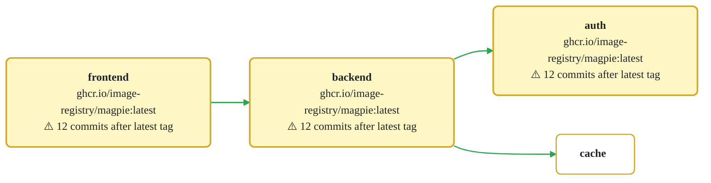

# Prototype App

A simple **Frontend → Backend → Database** application built with [Radius](https://radapp.io/) and Bicep.

## Architecture


> *Auto-generated by Radius from `app.bicep` — click any node to jump to its definition in the source.*




## Prerequisites

- [Radius CLI](https://docs.radapp.io/getting-started/) installed
- A Radius environment configured (e.g., local Kubernetes)

## Deploy

```bash
rad deploy app.bicep
```

## Project Structure

```
.
├── app.bicep            # Radius application definition
├── workflow-spec.md     # Workflow specification (CI/CD requirements)
└── README.md            # This file
```

## Workflow

See [workflow-spec.md](workflow-spec.md) to define CI/CD workflow requirements. Once authored, a GitHub Actions (or other CI/CD) workflow can be generated from it.
